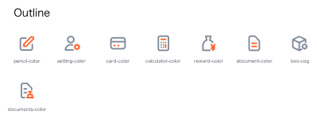
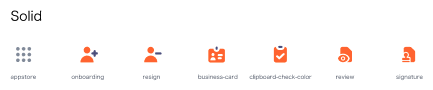
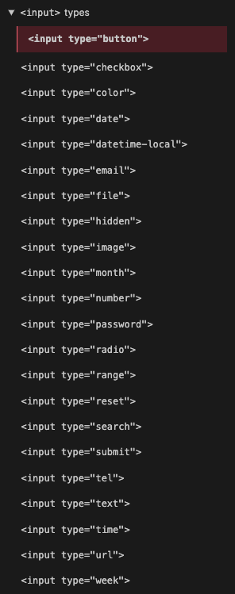

# @thaddeusjiang/omakase-ui 👋

> - Maybe you shouldn't use this library, just use tailwindcss and HTML is enough.
> - You don't need to use this library if you have lots of time to code and want to build the unique UI.

[](https://www.npmjs.com/package/@thaddeusjiang/omakase-ui)
[](https://github.com/ThaddeusJiang/omakase-ui#readme)
[](https://github.com/ThaddeusJiang/omakase-ui/graphs/commit-activity)
[](https://github.com/ThaddeusJiang/omakase-ui/blob/main/LICENSE)
[](https://twitter.com/ThaddeusJiang)

## Features

1. out of box utils of UIUX.
2. beautiful default styling.
3. without big external dependencies, like: [@tanstack/table](https://github.com/tanstack/table), [Downshift](https://github.com/downshift-js/downshift) and [Tippy.js](https://github.com/atomiks/tippyjs) etc.

## 🏠 [Homepage](https://github.com/ThaddeusJiang/omakase-ui#readme)

## Install

```sh
yarn add @thaddeusjiang/omakase-ui
```

# Components

- [@thaddeusjiang/omakase-ui 👋](#thaddeusjiangomakase-ui-)
  - [Features](#features)
  - [🏠 Homepage](#-homepage)
  - [Install](#install)
- [Components](#components)
  - [Common](#common)
    - [Button](#button)
    - [Icon](#icon)
    - [Typography](#typography)
  - [Layout](#layout)
    - [Divider](#divider)
    - [Grid](#grid)
    - [Layout](#layout-1)
    - [Space](#space)
  - [Navigation](#navigation)
    - [Affix](#affix)
    - [Breadcrumb](#breadcrumb)
    - [Dropdown](#dropdown)
    - [Menu](#menu)
    - [PageHeader](#pageheader)
    - [Pagination](#pagination)
    - [Steps](#steps)
  - [Data Entry](#data-entry)
    - [AutoComplete](#autocomplete)
    - [~~Cascader~~](#cascader)
    - [Checkbox](#checkbox)
    - [DatePicker](#datepicker)
    - [Form](#form)
    - [Input](#input)
    - [InputNumber](#inputnumber)
    - [Mentions](#mentions)
    - [Radio](#radio)
    - [Rate](#rate)
    - [Select](#select)
    - [Slider](#slider)
    - [Switch](#switch)
    - [TimePicker](#timepicker)
    - [~~Transfer~~](#transfer)
    - [TreeSelect](#treeselect)
    - [Upload](#upload)
  - [Data Display](#data-display)
    - [Avatar](#avatar)
    - [Badge](#badge)
    - [Calendar](#calendar)
    - [Card](#card)
    - [Carousel](#carousel)
    - [Collapse](#collapse)
    - [Comment](#comment)
    - [Descriptions](#descriptions)
    - [Empty](#empty)
    - [Image](#image)
    - [List](#list)
    - [Popover](#popover)
    - [Segmented](#segmented)
    - [Statistic](#statistic)
    - [Table](#table)
    - [Tabs](#tabs)
    - [Tag](#tag)
    - [Timeline](#timeline)
    - [Tooltip](#tooltip)
    - [Tree](#tree)
  - [Feedback](#feedback)
    - [Alert](#alert)
    - [Drawer](#drawer)
    - [Message](#message)
    - [Modal](#modal)
    - [Notification](#notification)
    - [Popconfirm](#popconfirm)
    - [Progress](#progress)
    - [Result](#result)
    - [Skeleton](#skeleton)
    - [Spin](#spin)
  - [Other](#other)
    - [Anchor](#anchor)
    - [BackTop](#backtop)
    - [ConfigProvider](#configprovider)
  - [Mockup](#mockup)
    - [Code](#code)
    - [Phone](#phone)
    - [Window](#window)
  - [Useful](#useful)
    - [LoadingIcon](#loadingicon)
    - [ScreenLoading](#screenloading)
    - [SectionLoading](#sectionloading)
    - [DataNotFound](#datanotfound)
- [Run tests](#run-tests)
- [Develop](#develop)
- [Author](#author)
- [🤝 Contributing](#-contributing)
- [Show your support](#show-your-support)
- [📝 License](#-license)

## Common

### Button

Don't need JS, learn https://daisyui.com/components/button/

### Icon

Recommend [heroicons v1](https://heroicons.com/) and [sodaicons](https://github.com/ThaddeusJiang/sodaicons)

> sodaicons supports Highlight colorful icons, just like:





> We recommend make all icons as button, apply :hover, :focus and other styles.

### Typography

## Layout

### Divider

[daisyUI](https://daisyui.com/components/divider/)

- [ ] left and right align
- [ ] [divider-solid divider-dotted divider-dashed divider-double](https://github.com/saadeghi/daisyui/issues/1163)

### Grid

### Layout

### Space

## Navigation

### Affix

### Breadcrumb

### Dropdown

[@radix-ui/react-dropdown-menu](https://www.radix-ui.com/docs/primitives/components/dropdown-menu)

### Menu

[daisyUI](https://daisyui.com/components/menu/)

### PageHeader

### Pagination

- [ ] provide utils for pagination

```jsx
<Pagination start={1} end={10} total={10015} currentPage={1} totalPage={101} onChangePage={onChangePage} />
```

### Steps

## Data Entry

### AutoComplete

### ~~Cascader~~

🙅‍♂️ Don't use this UI.

### Checkbox

Don't need JS, learn https://daisyui.com/components/checkbox/

### DatePicker

Don't need JS, learn [HTML input type="date" ](https://developer.mozilla.org/en-US/docs/Web/HTML/Element/input/date)

<input type="date">

```html
<input type="date" id="start" name="trip-start" value="2018-07-22" min="2018-01-01" max="2018-12-31" />
```

[HTML input type="datetime-local"](https://developer.mozilla.org/en-US/docs/Web/HTML/Element/input/datetime-local)

<input type="datetime-local">

```html
<input
  type="datetime-local"
  id="meeting-time"
  name="meeting-time"
  value="2018-06-12T19:30"
  min="2018-06-07T00:00"
  max="2018-06-14T00:00"
/>
```

others

input type="month"
<input type="month">

### Form

### Input

Don't need JS, learn [HTML native input](https://developer.mozilla.org/en-US/docs/Web/HTML/Element/input) and [input class](https://daisyui.com/components/input/).



### InputNumber

### Mentions

### Radio

Don't need JS, learn https://daisyui.com/components/radio/

### Rate

### Select

Simple select don't need JS, learn https://daisyui.com/components/select/.

Complex select and combobox recommend to use [react-select](https://github.com/jedwatson/react-select)

[examples](./stories/Select.stories.tsx)

### Slider

### Switch

Don't need JS, learn [daisyUI Toggle](https://daisyui.com/components/toggle/) and [daisyUI Swap](https://daisyui.com/components/swap/).
daisyUI is super cool, you should try it.

### TimePicker

Don't need JS, learn

[HTML input type="datetime-local"](https://developer.mozilla.org/en-US/docs/Web/HTML/Element/input/datetime-local)

<input type="datetime-local">
```html
<input
  type="datetime-local"
  id="meeting-time"
  name="meeting-time"
  value="2018-06-12T19:30"
  min="2018-06-07T00:00"
  max="2018-06-14T00:00"
/>
```

[HTML input type="time"](https://developer.mozilla.org/en-US/docs/Web/HTML/Element/input/time)

<input type="time">

```html
<input type="time" id="appt" name="appt" min="09:00" max="18:00" required />
```

### ~~Transfer~~

🙅‍♂️ Never use this UI

### TreeSelect

### Upload

## Data Display

### Avatar

[daisyUI Avatar](https://daisyui.com/components/avatar/)

### Badge

[daisyUI Badge](https://daisyui.com/components/badge/)

### Calendar

### Card

### Carousel

### Collapse

### Comment

### Descriptions

### Empty

### Image

### List

### Popover

### Segmented

### Statistic

### Table

### Tabs

### Tag

### Timeline

### Tooltip

Don't need JS, we recommend [HTML tooltip](https://developer.mozilla.org/en-US/docs/Web/HTML/Global_attributes/title)

```html
<div title="CoolTip">
  <p>Hovering here will show "CoolTip".</p>

  <p title="">Hovering here will show nothing.</p>
</div>
```

- no JS (Must)
- no CSS (Optional, don't over styling.) confirm you didn't make a bug [tweet](https://twitter.com/ThaddeusJiang/status/1460773968063787014)

### Tree

## Feedback

### Alert

https://daisyui.com/components/alert/

### Drawer

### Message

Recommend [react-hot-toast](https://github.com/timolins/react-hot-toast)

### Modal

Recommend [Radix Alert Dialog](https://www.radix-ui.com/docs/primitives/components/alert-dialog) and [Radix Dialog](https://www.radix-ui.com/docs/primitives/components/dialog)

> Why:
> We love self control dialog component, we don't want to write a lot of State for `isOpen` and `setIsOpen`

> Why we don't use daisyUI Modal?
> We need accessibility.

KnowHow

- `Radix Alert Dialog` for confirm
- `Radix Dialog` for asynchronous form submission

### Notification

### Popconfirm

### Progress

### Result

### Skeleton

### Spin

## Other

### Anchor

### BackTop

### ConfigProvider

## Mockup

### Code

[daisyUI](https://daisyui.com/components/mockup-code/)

### Phone

[daisyUI](https://daisyui.com/components/mockup-phone/)

### Window

[daisyUI](https://daisyui.com/components/mockup-window/)

BTW, we recommend to not mock up Phone and Window.
Welcome to try [@omakase-ui/react-responsive-design-mode](https://www.npmjs.com/package/@omakase-ui/react-responsive-design-mode)

## Useful

### LoadingIcon

### ScreenLoading

### SectionLoading

### DataNotFound

# Run tests

```sh
yarn run test
```

# Develop

```sh
yarn storybook
```

# Author

👤 **Thaddeus Jiang**

- Website: https://thaddeusjiang.com/
- Twitter: [@ThaddeusJiang](https://twitter.com/ThaddeusJiang)
- Github: [@ThaddeusJiang](https://github.com/ThaddeusJiang)

# 🤝 Contributing

Contributions, issues and feature requests are welcome!

Feel free to check [issues page](https://github.com/ThaddeusJiang/omakase-ui/issues). You can also take a look at the [contributing guide](https://github.com/ThaddeusJiang/omakase-ui/blob/main/CONTRIBUTING.md).

# Show your support

Give a ⭐️ if this project helped you!

# 📝 License

Copyright © 2022 [Thaddeus Jiang](https://github.com/ThaddeusJiang).

This project is [MIT](https://github.com/ThaddeusJiang/omakase-ui/blob/main/LICENSE) licensed.

---

_This README was generated with ❤️ by [readme-md-generator](https://github.com/kefranabg/readme-md-generator)_
