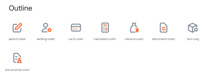
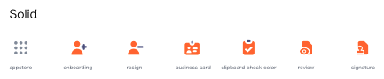
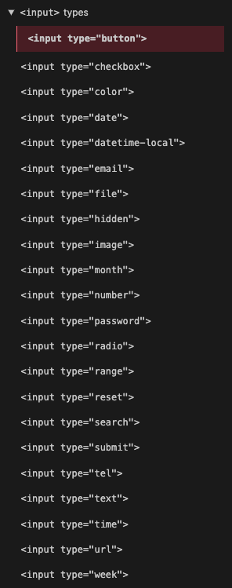

# @omakase-ui/basic

- [@omakase-ui/basic](#omakase-uibasic)
  - [Common](#common)
    - [✅Button](#button)
    - [✅Icon](#icon)
    - [Typography](#typography)
  - [Layout](#layout)
    - [✅Divider](#divider)
    - [Grid](#grid)
    - [Layout](#layout-1)
    - [Space](#space)
  - [Navigation](#navigation)
    - [Affix](#affix)
    - [Breadcrumb](#breadcrumb)
    - [✅Dropdown](#dropdown)
    - [Menu](#menu)
    - [PageHeader](#pageheader)
    - [✅Pagination](#pagination)
    - [Steps](#steps)
  - [Data Entry](#data-entry)
    - [AutoComplete](#autocomplete)
    - [Cascader](#cascader)
    - [✅Checkbox](#checkbox)
    - [DatePicker](#datepicker)
    - [Form](#form)
    - [✅Input](#input)
    - [InputNumber](#inputnumber)
    - [Mentions](#mentions)
    - [✅Radio](#radio)
    - [Rate](#rate)
    - [✅Select](#select)
    - [Slider](#slider)
    - [✅Switch](#switch)
    - [✅TimePicker](#timepicker)
    - [❌Transfer](#transfer)
    - [TreeSelect](#treeselect)
    - [Upload](#upload)
  - [Data Display](#data-display)
    - [✅Avatar](#avatar)
    - [Badge](#badge)
    - [Calendar](#calendar)
    - [Card](#card)
    - [Carousel](#carousel)
    - [Collapse](#collapse)
    - [Comment](#comment)
    - [Descriptions](#descriptions)
    - [Empty](#empty)
    - [Image](#image)
    - [List](#list)
    - [Popover](#popover)
    - [Segmented](#segmented)
    - [Statistic](#statistic)
    - [Table](#table)
    - [Tabs](#tabs)
    - [Tag](#tag)
    - [Timeline](#timeline)
    - [✅Tooltip](#tooltip)
    - [Tree](#tree)
  - [Feedback](#feedback)
    - [Alert](#alert)
    - [Drawer](#drawer)
    - [✅Message](#message)
    - [✅Modal](#modal)
    - [Notification](#notification)
    - [Popconfirm](#popconfirm)
    - [Progress](#progress)
    - [Result](#result)
    - [Skeleton](#skeleton)
    - [Spin](#spin)
  - [Other](#other)
    - [Anchor](#anchor)
    - [BackTop](#backtop)
    - [ConfigProvider](#configprovider)
  - [Mockup](#mockup)
    - [✅Code](#code)
    - [✅Phone](#phone)
    - [✅Window](#window)

## Common

### ✅Button

Recommend [daisyUI](https://daisyui.com/components/button/)

### ✅Icon

Recommend [heroicons v1](https://heroicons.com/) and [sodaicons](https://github.com/ThaddeusJiang/sodaicons)

> sodaicons supports Highlight colorful icons, just like:





> We recommend make all icons as button, apply :hover, :focus and other styles.

### Typography

## Layout

### ✅Divider

[daisyUI](https://daisyui.com/components/divider/)

- [ ] left and right align
- [ ] [divider-solid divider-dotted divider-dashed divider-double](https://github.com/saadeghi/daisyui/issues/1163)


### Grid
### Layout
### Space

## Navigation
### Affix
### Breadcrumb
### ✅Dropdown

[@radix-ui/react-dropdown-menu](https://www.radix-ui.com/docs/primitives/components/dropdown-menu)

### Menu

[daisyUI](https://daisyui.com/components/menu/)

### PageHeader
### ✅Pagination

[daisyUI btn-group](https://daisyui.com/components/pagination/)

- [] provide utils for pagination

### Steps

## Data Entry

### AutoComplete
### Cascader
### ✅Checkbox

[daisyUI](https://daisyui.com/components/checkbox/)

### DatePicker

Recommend [HTML <input type="date">](https://developer.mozilla.org/en-US/docs/Web/HTML/Element/input/date)

```html
<input type="date" id="start" name="trip-start"
       value="2018-07-22"
       min="2018-01-01" max="2018-12-31">
```

[HTML <input type="datetime-local">](https://developer.mozilla.org/en-US/docs/Web/HTML/Element/input/datetime-local)

```html
<input type="datetime-local" id="meeting-time"
       name="meeting-time" value="2018-06-12T19:30"
       min="2018-06-07T00:00" max="2018-06-14T00:00">
```

others

[<input type="month">]()

### Form
### ✅Input

[daisyUI](https://daisyui.com/components/input/)

HTML native input should learn again 

### InputNumber
### Mentions
### ✅Radio

Recommend [daisyUI](https://daisyui.com/components/radio/)

### Rate
### ✅Select

[daisyUI](https://daisyui.com/components/select/)

### Slider
### ✅Switch

Recommend [daisyUI Toggle](https://daisyui.com/components/toggle/)

[daisyUI Swap](https://daisyui.com/components/swap/) is super cool, you should try it.

### ✅TimePicker

[HTML <input type="datetime-local">](https://developer.mozilla.org/en-US/docs/Web/HTML/Element/input/datetime-local)

```html
<input type="datetime-local" id="meeting-time"
       name="meeting-time" value="2018-06-12T19:30"
       min="2018-06-07T00:00" max="2018-06-14T00:00">
```

[HTML <input type="time">](https://developer.mozilla.org/en-US/docs/Web/HTML/Element/input/time)

```html
<input type="time" id="appt" name="appt"
       min="09:00" max="18:00" required>
```

### ❌Transfer

Never use this UI

### TreeSelect
### Upload

## Data Display

### ✅Avatar

[daisyUI](https://daisyui.com/components/avatar/)

### Badge

[daisyUI](https://daisyui.com/components/badge/)

### Calendar
### Card
### Carousel
### Collapse
### Comment
### Descriptions
### Empty
### Image
### List
### Popover
### Segmented
### Statistic
### Table
### Tabs
### Tag
### Timeline
### ✅Tooltip

We recommend [HTML tooltip](https://developer.mozilla.org/en-US/docs/Web/HTML/Global_attributes/title)

```html
<div title="CoolTip">
  <p>Hovering here will show "CoolTip".</p>
  <p title="">Hovering here will show nothing.</p>
</div>
```

- no JS (Must)
- no CSS (Optional, don't over styling.) confirm you didn't make a bug [tweet](https://twitter.com/ThaddeusJiang/status/1460773968063787014)

### Tree

## Feedback

### Alert

[daisyUI](https://daisyui.com/components/alert/)

### Drawer
### ✅Message

Recommend [react-hot-toast](https://github.com/timolins/react-hot-toast)

### ✅Modal

Recommend [Radix Alert Dialog](https://www.radix-ui.com/docs/primitives/components/alert-dialog) and [Radix Dialog](https://www.radix-ui.com/docs/primitives/components/dialog)

> Why:
> We love self control dialog component, we don't want to write a lot of State for `isOpen` and `setIsOpen`

> Why we don't use daisyUI Modal?
> We need accessibility.

KnowHow

-  `Radix Alert Dialog` for confirm
-  `Radix Dialog` for asynchronous form submission

### Notification
### Popconfirm
### Progress
### Result
### Skeleton
### Spin

## Other

### Anchor
### BackTop
### ConfigProvider

## Mockup

### ✅Code

[daisyUI](https://daisyui.com/components/mockup-code/)

### ✅Phone

[daisyUI](https://daisyui.com/components/mockup-phone/)

### ✅Window

[daisyUI](https://daisyui.com/components/mockup-window/)

BTW, we recommend to not mock up Phone and Window.
Welcome to try [@omakase-ui/react-responsive-design-mode](https://www.npmjs.com/package/@omakase-ui/responsive-design-mode)
