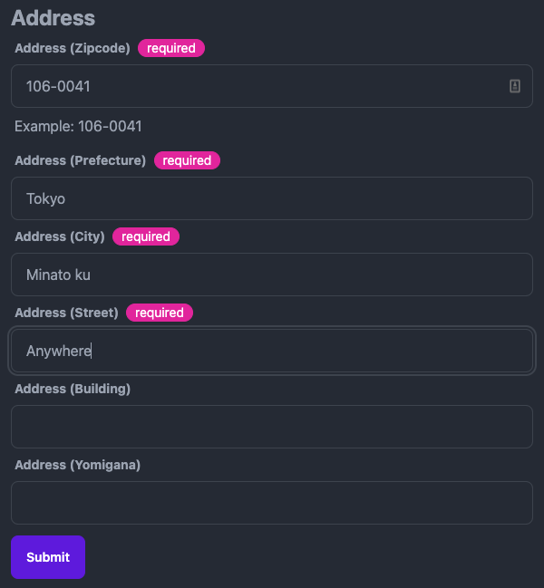

# @omakase-ui/react-e-components

[](https://www.npmjs.com/package/@omakase-ui/react-e-components)
[](https://twitter.com/ThaddeusJiang)

What is Omakase UI react-e-components?

1. out of box for Enterprise Application, like: Talent Application, Payroll Application, and etc.

Catalog

- [@omakase-ui/react-e-components](#omakase-uireact-e-components)
- [Components](#components)
  - [AddressForm](#addressform)

# Components

## AddressForm

```js
<AddressForm onSubmit={onSubmit} />
```


